# 👋 Hey, I’m Cyril

<!-- ANIMATED-CARDS:START -->
<table>
  <tr>
    <td></td>
    <td></td>
  </tr>
</table>

  

<!-- ANIMATED-CARDS:END -->

I build things that solve problems—sometimes with code, sometimes with conversation.

As a Technical PM and Software Engineer, I live at the intersection of people, products, and practicality. I like asking *why*, mapping out *what*, and helping ship the *how*.

---

### 🧩 Currently Into

- 🧪 Building tools that remove friction (looking at you, SpecLinter)
- 📍 Running experiments on check-in flows, UX, and user behavior (see: Georim)
- 🛠️ Working with Figma, Firebase, React, Python, and friends
- 📊 Getting deeper into product metrics and the stories they tell

---

### ✍️ Favorite Parts of the Work

- Whiteboarding messy ideas into clean flows
- Making trade-offs that keep users in mind
- Writing docs that *actually* get read
- Shipping — even if it's v0.5

---

### 🎒 A Little Backstory

Studying Computer Science with a Business Management minor  
Building at the intersection of product, engineering, and impact  
Obsessed with good design, clear specs, clean code and fast feedback loops

---

### 📬 Let’s Talk

Whether it’s about product thinking, side projects, or building better tools—I'm always down for a chat.

> *“Let’s build something that works.”*

---

### 📬 Let’s Connect

You’ll find me:
- Posting small wins & reflections [on LinkedIn](https://www.linkedin.com/in/cyril-kups))
- Experimenting with side projects here on GitHub
- Probably sketching UI flows in a random notebook

---

> *"Build with purpose. Design to be different."*
